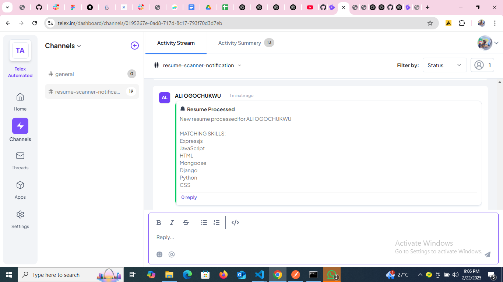

# Telex Automated Resume Scanner

## Overview
The **Telex Automated Resume Scanner** is an integration that processes uploaded resumes, extracts key information (name, email, phone, and skills), and sends structured notifications to a configured Telex channel.

## Features
-  Upload PDF resumes for automatic parsing.
-  Extracts contact details and skills from resumes.
-  Matches skills against a predefined, configurable skill set.
-  Sends structured notifications to Telex.
-  Provides integration settings via `/integration-config`.

---

##  Setup Instructions

### 1️⃣ Clone the Repository
```bash
git clone https://github.com/your-repo/telex-resume-scanner.git
cd telex-resume-scanner
```

### 2️⃣ Install Dependencies
Ensure you have **Python** installed, then run:
```bash
pip install -r requirements.txt
```

### 3️⃣ Configure Environment Variables
Create a `.env` file in the root directory and define:
```ini
TELEX_WEBHOOK_URL=<your_telex_webhook_url>
FLASK_RUN_HOST=127.0.0.1
FLASK_RUN_PORT=5000
```

### 4️⃣ Configure Telex Settings
Modify `telex_config.json` to match your integration requirements:
```json
{
  "data": {
    "app_name": "Telex Automated Resume Scanner",
    "integration_category": "Human Resources & Payroll",
    "target_url": "https://your-api-url/integration-config",
    "settings": [
      {
        "label": "List of Skills required",
        "default": ["Python", "React", "Node.js", "SQL"]
      }
    ]
  }
}
```

### 5️⃣ Start the Flask API
```bash
python app.py
```
The API will run on **[http://127.0.0.1:5000](http://127.0.0.1:5000)**.

---

## 📌 Usage Instructions

### 1️⃣ Upload a Resume
Send a `POST` request to `/upload` with a PDF file:
```bash
curl -X POST -F "file=@resume.pdf" http://127.0.0.1:5000/upload
```
💡 **Response Example:**
```json
{
  "name": "John Doe",
  "email": "johndoe@example.com",
  "phone": "+1234567890",
  "skills": ["Python", "React"]
}
```

### 2️⃣ Get Integration Settings
Retrieve current **Telex integration settings**:
```bash
curl -X GET http://127.0.0.1:5000/integration-config
```

### 3️⃣ Update Integration Settings
Modify the Telex settings dynamically via `POST /integration-config`:
```bash
curl -X POST http://127.0.0.1:5000/integration-config -H "Content-Type: application/json" -d '{
  "data": {
    "settings": [
      {
        "label": "Minimum Skill Match",
        "default": 4
      }
    ]
  }
}'
```

---

## 📦 Deployment

### 1️⃣ Deploy Locally (for Testing)
Run Flask in development mode:
```bash
FLASK_ENV=development flask run
```

### 2️⃣ Deploy to Production
For production deployment, use **Gunicorn** and **Nginx**:
```bash
gunicorn -w 4 -b 0.0.0.0:5000 app:app
```

---

✅ **Telex Notification**

---

## 👨‍💻 Contributors
**Ali Ogochukwu Peter** - *Lead Developer*

License
This project is licensed under the MIT License - see the LICENSE file for details.